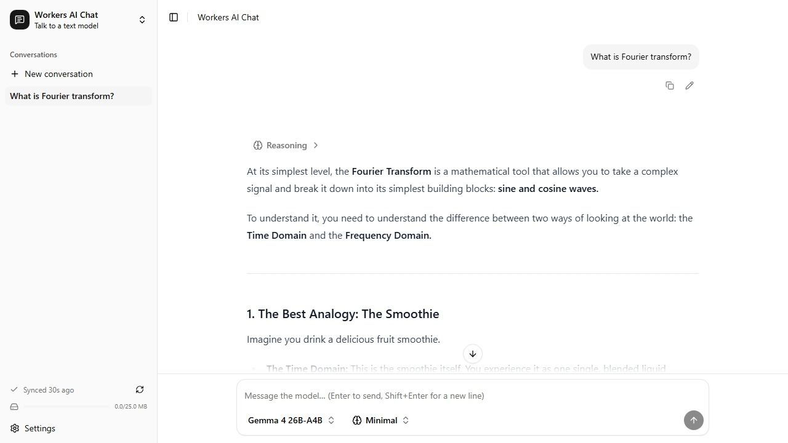
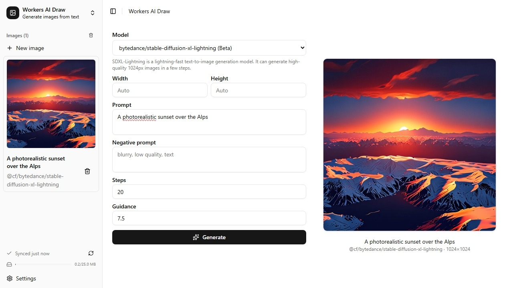

# ACFB AI Studio

**ACFB (A Cloudflare Based) AI Studio** is a lightweight, open-source web application for text and image generation powered directly by your personal Cloudflare Workers AI daily quota.

Deploy your own private, self-hosted instance in under a minute with one click:

[](https://deploy.workers.cloudflare.com/?url=https://github.com/Karsten-Zhou/acfb-ai-studio)

> **Tip:** We strongly recommend enabling **Cloudflare Access** on your deployed Worker to secure your studio and prevent unauthorized usage of your quota.

## Features

| Chat                           | Draw                           |
| ------------------------------ | ------------------------------ |
|  |  |

- **100% Free & Open-Source:** No tracking, ads, analytics, or telemetry. Runs entirely on your personal Cloudflare Workers AI allowance.
- **Complete Model Support:** Access all available text and image generation models provided by Cloudflare Workers AI (free tier).
- **Modern UI & UX:** Features dark/light mode themes, multi-language support, and a fully responsive layout across desktop and mobile devices.
- **Cross-Device Sync**: Synchronize images and chat history across your devices.

## Tech Stack

| Layer                  | Technology                               |
| ---------------------- | ---------------------------------------- |
| **Runtime**            | Cloudflare Workers (`workerd`)           |
| **Server**             | Hono + `@hono/zod-validator`             |
| **AI Integration**     | `@cloudflare/ai` (Workers AI binding)    |
| **Frontend**           | Vue 3 (`<script setup>`) + Vite          |
| **UI Components**      | `shadcn-vue` (Reka UI) + Tailwind CSS v4 |
| **Markdown Rendering** | Marked + Shiki + DOMPurify               |

## Project Layout

```text
├── src/                      # Vue 3 frontend
│   ├── views/                # Route views (Chat, Draw, Image, NotFound)
│   ├── components/           # Core layout components (AppHeader, AppSidebar, SyncStatus)
│   │   ├── chat/             # Chat interface (ChatInput, ChatMessage)
│   │   ├── settings/         # Preferences and settings modals
│   │   └── ui/               # shadcn-vue primitives (new-york-v4)
│   ├── stores/               # Pinia state management (chat, draw, preferences, sync)
│   ├── composables/          # Vue composables (chat-defaults, sync)
│   ├── lib/                  # Utilities (api-error, markdown, i18n, query-client)
│   ├── locales/              # i18n translations (en, zh, de)
│   ├── router/               # Vue Router configuration
│   └── shikithemes/          # Code syntax highlighting themes
│
├── server/                   # Cloudflare Worker backend
│   ├── index.ts              # Worker entry point
│   ├── chat.ts, draw.ts      # AI chat & image endpoints
│   ├── sync.ts, sync-storage.ts # Data synchronization handlers
│   └── errors.ts, image-dimensions.ts
│
├── shared/                   # Shared TypeScript types & validation schemas
│   ├── api.ts, chat.ts, draw.ts, errors.ts, sync.ts
│   └── generated/            # Codegen models, schemas, and traits
│
├── scripts/                  # Model & theme synchronization scripts
├── wrangler.jsonc            # Cloudflare Workers configuration
├── vite.config.ts            # Vite configuration (frontend + worker build)
└── vitest.config.ts          # Unit testing setup
```

## Getting Started

### Prerequisites

- [Bun](https://bun.sh/) runtime installed.
- A Cloudflare account with Workers AI enabled.

### Local Development

1. **Clone the repository and install dependencies:**

```bash
git clone https://github.com/Karsten-Zhou/acfb-ai-studio.git
cd acfb-ai-studio
bun install
```

2. **Authenticate with Cloudflare:**

```bash
bunx wrangler login
```

3. **Start the local development server:**

```bash
bun run dev
```

4. **Deploy to Cloudflare Workers:**

```bash
bun run deploy
```

## TODO

- [ ] Toolcalling for text generation models.
- [ ] Optimise datetime and filesize formats for different locales.
- [ ] Add more language translations.
- [ ] Daily quota usage tracking.

## My Other Projects

- [ACFB RSS Reader](https://github.com/Karsten-Zhou/acfb-rss-reader)
- [ACFB Email Client](https://github.com/Karsten-Zhou/acfb-email-client)